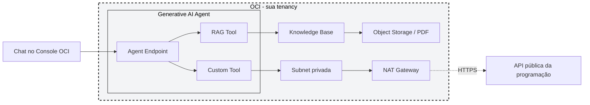

# Lab TDC: AI Agents na OCI com Terraform (RAG + Custom Tool)

Este projeto contém o material de apoio para subir, via Terraform, um agente de IA generativa na Oracle Cloud Infrastructure, usando:

- OCI Generative AI Agents;
- Object Storage;
- Knowledge Base com RAG;
- Custom Tool via API pública já preparada;
- endpoint do agente;
- programação real do TDC Floripa 2026 como dataset estruturado da tool;
- Terraform, via Resource Manager Stack, para provisionar tudo de uma vez.

O objetivo do lab é criar um agente chamado **Assistente TDC Floripa**, capaz de responder perguntas gerais sobre o evento usando RAG e consultar programação, horários, sessões e speakers usando uma tool. A diferença para uma configuração manual é que aqui você não cria recurso por recurso no Console: sobe uma Stack, preenche algumas variáveis e o Terraform cuida de criar compartment, grupo, policy, rede, bucket, Knowledge Base, agent, tools e endpoint, nessa ordem.

## Demo do lab

O agente responde perguntas como:

```text
Quando acontece o TDC Floripa 2026?
```

```text
Quais trilhas existem no dia 22 de julho?
```

```text
Quais palestras a Livia Rodrigues vai fazer?
```

Perguntas sobre conceitos gerais, jornadas, formato, FAQ e regras usam **RAG**, porque a resposta está no PDF que vira a base de conhecimento do agente. Perguntas sobre busca estruturada de sessões, speakers, trilhas por dia e filtros usam a **Custom Tool**, porque dependem de uma consulta em tempo real na API de programação.

## Arquitetura



> A arquitetura mostra o fluxo de execução da demo. Compartment, grupo e policy aparecem no passo a passo como pré-requisitos de segurança, mas não entram no diagrama de runtime porque não fazem parte do caminho que uma pergunta percorre. A subnet privada com NAT Gateway existe para a Custom Tool conseguir fazer egress HTTPS para a API pública da programação; não há subnet pública nem Internet Gateway porque nenhum outro recurso deste lab precisa de IP público.

A Custom Tool usa a API pública já publicada:

```text
https://tdc-oci-ai-agents-lab.onrender.com
```

Se você quiser apontar para a sua própria cópia da API, troque a variável `custom_tool_api_url` na tela de variáveis da Stack.

## Pré-requisitos

- Conta OCI Trial ativa.
- Acesso ao OCI Console.
- Região com OCI Generative AI Agents disponível.
- Permissão para criar compartment, policies, rede, bucket, knowledge base, agent e endpoint. O dono de uma tenancy trial já tem esse acesso por padrão, como administrator.
- Acesso à internet para o agente consultar a API pública da programação.
- O arquivo zip deste repositório, para subir como Stack no Resource Manager.

## 1. Preparar o pacote da Stack

O Resource Manager sobe a partir de um `.zip` com os arquivos Terraform na raiz. Clone o repositório e gere o zip a partir da pasta `terraform/trial-tenancy`:

```bash
git clone https://github.com/LiviaFernandes/tdc-oci-ai-agents-terraform-lab.git
cd tdc-oci-ai-agents-terraform-lab/terraform/trial-tenancy
zip -r ../../tdc-ai-agents-trial.zip .
```

Isso gera `tdc-ai-agents-trial.zip` na raiz do repositório, já com os arquivos `.tf` e a pasta `assets/` (o PDF da base RAG e o contrato OpenAPI da Custom Tool) no lugar certo.

## 2. Criar a Stack

1. Abra o OCI Console.
2. Vá em **Developer Services**.
3. Entre em **Resource Manager**.
4. Clique em **Stacks**.
5. Clique em **Create Stack**.
6. Escolha upload de `.zip`.
7. Envie `tdc-ai-agents-trial.zip`.
8. Escolha o compartment onde a Stack em si vai ficar (não é o compartment do lab, esse o Terraform cria sozinho).
9. Dê um nome para a stack, por exemplo `tdc-ai-agents-lab`.
10. Clique em **Next**.

## 3. Preencher as variáveis

O Resource Manager lê o `variables.tf` do pacote e monta um formulário automático na tela seguinte. Preencha:

```text
tenancy_ocid = ocid da sua tenancy
user_ocid    = ocid do seu usuario
region       = regiao com Generative AI Agents disponivel
```

Onde encontrar cada valor:

- `tenancy_ocid`: no OCI Console, clique no seu perfil (canto superior direito) e depois em **Tenancy**.
- `user_ocid`: no OCI Console, clique no seu perfil e depois em **User settings**.

As demais variáveis (nome do compartment, nome do grupo, mensagens do agente, descrição das tools) já vêm preenchidas com valores padrão. Não precisa mexer nelas para rodar o lab, mas pode ajustar se quiser personalizar.

Clique em **Next**, revise o resumo e siga em frente.

## 4. Rodar o Apply

Marque **Run apply** na criação da stack, ou rode um Apply depois, na tela da Stack.

O apply cria, nesta ordem:

```text
compartment tdc-ai-agents-lab
grupo tdc-ai-agents-users, com voce como membro
policy no root da tenancy
VCN com subnet privada e NAT Gateway
bucket com o PDF da base RAG
Knowledge Base + data source + job de ingestao
o agent
RAG tool
Custom Tool
Agent Endpoint
```

Costuma levar entre 5 e 10 minutos, a maior parte do tempo é a criação da Knowledge Base e do endpoint. Quando o status da Stack virar **Succeeded**, o lab está pronto.

## 5. Conferir os outputs

Na Stack, vá na aba **Outputs**. Lá estão os IDs de cada recurso criado e uma dica de onde clicar no Console para abrir o chat do agente.

## 6. Testar no chat

Abra o OCI Console em **Analytics & AI > Generative AI Agents > Agent endpoints**, clique no endpoint criado e depois em **Launch chat**.

### Teste 1: RAG com informação geral do evento

```text
O que são as Jornadas TDC e como elas ajudam uma pessoa a escolher melhor a experiência dela no TDC Floripa 2026?
```

Resultado esperado: resposta conceitual sobre Jornadas TDC e formato do evento. O trace deve mostrar uso da RAG Tool `consulta_base_tdc`.

### Teste 2: Custom Tool com speaker específica

```text
Quais palestras a Livia Rodrigues vai fazer?
```

Resultado esperado: resposta com as sessões da Livia Rodrigues Fernandes Silva. O trace deve mostrar chamada a `consulta_programacao_tdc`.

### Teste 3: RAG + Custom Tool na mesma resposta

```text
Estou interessado em GenAI e agentes. Explique rapidamente como o TDC organiza trilhas ou jornadas e depois liste sessões da programação que falem sobre agentes.
```

Resultado esperado: a primeira parte da resposta vem da RAG, explicando organização, jornadas ou trilhas; a segunda parte vem da Custom Tool, listando sessões filtradas por `agentes` ou termos relacionados.

### Teste 4: roteiro personalizado

```text
Tenho acesso ao dia 24/jul e me interesso por GenAI, LLMs e avaliação de modelos. Monte um roteiro objetivo para mim com as sessões mais relevantes, horários e trilha.
```

Resultado esperado: o agente usa a Custom Tool para buscar sessões do dia 24/jul relacionadas a GenAI/LLMs e monta um roteiro em ordem de horário.

## Variáveis principais

Estas são as variáveis que aparecem no formulário da Stack (ou em `terraform/trial-tenancy/variables.tf`, se você preferir rodar localmente):

| Variável | Descrição |
| --- | --- |
| `tenancy_ocid` | OCID da sua tenancy. Usado para criar o compartment e a policy no root. |
| `user_ocid` | OCID do usuário que entra no grupo do lab, normalmente você mesma. |
| `region` | Região OCI com Generative AI Agents disponível. |
| `custom_tool_api_url` | URL base da API de programação usada pela Custom Tool. |
| `agent_instruction` | System prompt do agente, o que ele deve e não deve fazer. |

## Custo, sem complicar

| Parte | Como pensar |
| --- | --- |
| Rede | VCN, subnet privada, NAT Gateway e security list não cobram por existir; tráfego de saída pode seguir as regras de cobrança da OCI. |
| Object Storage | O PDF da base RAG é pequeno; fica dentro do free tier na maioria das tenancies. |
| Generative AI Agents | Knowledge Base, agent e tools cobram por uso: consultas, ingestão e tokens do LLM por trás do RAG e das respostas. Usou pouco no lab, paga pouco. |

Para não deixar recursos ligados sem necessidade, destrua o lab quando terminar. Na tela da Stack, clique em **Destroy** e depois em **Apply** para confirmar.

## Rodando localmente, sem Resource Manager

Se preferir não usar o Console, dá para rodar a mesma pasta com o Terraform local:

```bash
cd terraform/trial-tenancy
cp terraform.tfvars.example terraform.tfvars
# preencha tenancy_ocid, user_ocid e region no terraform.tfvars
terraform init
terraform plan
terraform apply
```

Para destruir:

```bash
terraform destroy
```
