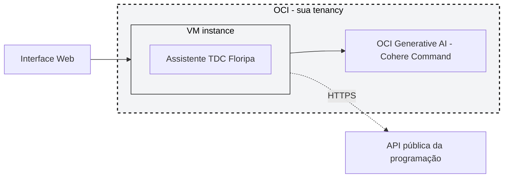

# Lab TDC: AI Agents na OCI com Terraform (RAG + Custom Tool)

Este projeto contém o material de apoio para subir, via Terraform, um agente de IA generativa na Oracle Cloud Infrastructure, usando:

- OCI Generative AI (inferencia direta, modelos Cohere Command);
- uma VM que roda o agente, no estilo IaaS;
- RAG por injeção de contexto direto na chamada de chat, com a base do TDC Floripa 2026;
- Custom Tool via function-calling nativo do modelo, chamando a API pública já preparada;
- programação real do TDC Floripa 2026 como dataset estruturado da tool;
- Terraform, via Resource Manager Stack, para provisionar tudo de uma vez.

O objetivo do lab é criar um agente chamado **Assistente TDC Floripa**, capaz de responder perguntas gerais sobre o evento usando RAG e consultar programação, horários, sessões e speakers usando uma tool. Diferente de usar um serviço gerenciado de agentes, aqui a infraestrutura é simples e rápida: uma VM sobe, instala um app Node.js leve, e esse app conversa direto com o OCI Generative AI usando a identidade da própria instância (instance principal), sem precisar de API key. Você sobe uma Stack no Resource Manager, que já vem com tenancy e região preenchidas automaticamente pela sua sessão, espera alguns minutos e recebe uma URL pronta para conversar com o agente.

## Demo do lab

O agente responde perguntas como:

```text
Quando acontece o TDC Floripa 2026?
```

```text
Quais trilhas existem no dia 22 de julho?
```

```text
Quais palestras a Livia Rodrigues vai fazer?
```

Perguntas sobre conceitos gerais, jornadas, formato, FAQ e regras usam **RAG**, porque a resposta está nos documentos de contexto que o app carrega junto com cada pergunta. Perguntas sobre busca estruturada de sessões, speakers, trilhas por dia e filtros usam a **Custom Tool**, porque dependem de uma consulta em tempo real na API de programação.

## Arquitetura



O app roda inteiro dentro da VM: serve a interface de chat, monta a chamada para o OCI Generative AI incluindo os documentos de RAG e a definição da Custom Tool, e quando o modelo decide chamar a tool, o próprio app executa a chamada HTTP para a API de programação e devolve o resultado ao modelo. Não existe Knowledge Base, Object Storage nem Agent Endpoint gerenciado — a VM tem IP público porque é ela quem serve o chat, e o egress para a API de programação e para o OCI Generative AI sai pelo Internet Gateway da subnet pública.

A Custom Tool usa a API pública já publicada:

```text
https://tdc-oci-ai-agents-lab.onrender.com
```

Se você quiser apontar para a sua própria cópia da API, troque a variável `custom_tool_api_url` na tela de variáveis da Stack.

## Pré-requisitos

- Conta OCI Trial ativa, com home region São Paulo (`sa-saopaulo-1`). Veja o passo 1 se você ainda não tem uma.
- Acesso ao OCI Console.
- Permissão para criar compartment, dynamic group, policy, rede e instância. O dono de uma tenancy trial já tem esse acesso por padrão, como administrator.
- O arquivo zip deste repositório, para subir como Stack no Resource Manager.

## 1. Criar a conta trial OCI

Se você já tem uma tenancy trial, pule para o passo 2.

1. Acesse [oracle.com/cloud/free](https://www.oracle.com/cloud/free/) e clique em **Start for free**.
2. Preencha os dados pedidos (nome, email, país, telefone) e confirme o cadastro.
3. Quando for pedida a home region, escolha **South America (São Paulo)** (`sa-saopaulo-1`). Essa escolha é definitiva: depois de criada, a tenancy não muda de home region.
4. A Oracle manda um email confirmando a criação da conta, com o nome da sua tenancy (tenancy name). Guarde esse nome — é ele que você usa para logar, não o email.
5. Acesse o Console em [cloud.oracle.com](https://cloud.oracle.com/) e faça login informando o tenancy name confirmado por email.
6. No primeiro login, a OCI pede para configurar autenticação em duas etapas. Baixe um app autenticador no celular, como o Oracle Mobile Authenticator, escaneie o QR code mostrado na tela e confirme o código gerado para concluir o login.

Com a conta criada e o primeiro login feito, siga para o restante do lab.

## 2. Preparar o pacote da Stack

O Resource Manager sobe a partir de um `.zip` com os arquivos Terraform na raiz. O jeito mais rápido é baixar o zip já pronto direto deste repositório:

```text
https://github.com/LiviaFernandes/tdc-oci-ai-agents-terraform-lab/raw/main/tdc-ai-agents-trial.zip
```

Abra o link no navegador e o download de `tdc-ai-agents-trial.zip` começa sozinho — não precisa clonar nada.

Se você alterou algum arquivo `.tf` ou do app e quer gerar o zip você mesma, clone o repositório e empacote a pasta `terraform`:

```bash
git clone https://github.com/LiviaFernandes/tdc-oci-ai-agents-terraform-lab.git
cd tdc-oci-ai-agents-terraform-lab/terraform
zip -r ../tdc-ai-agents-trial.zip .
```

De qualquer uma das duas formas, o zip fica com os arquivos `.tf`, o `cloud-init.yaml.tftpl` e a pasta `app/` (o código do Assistente TDC Floripa) na raiz do pacote, do jeito que o Resource Manager espera.

## 3. Criar a Stack

1. Abra o OCI Console.
2. Vá em **Developer Services**.
3. Entre em **Resource Manager**.
4. Clique em **Stacks**.
5. Clique em **Create Stack**.
6. Escolha upload de `.zip`.
7. Envie `tdc-ai-agents-trial.zip`.
8. Escolha o compartment onde a Stack em si vai ficar (não é o compartment do lab, esse o Terraform cria sozinho).
9. Dê um nome para a stack, por exemplo `tdc-ai-agents-lab`.
10. Clique em **Next**.

## 4. Preencher as variáveis

O Resource Manager lê o `variables.tf` do pacote e monta um formulário automático na tela seguinte. As duas variáveis obrigatórias — `tenancy_ocid` e `region` — usam nomes especiais que o Resource Manager reconhece e já vem preenchendo sozinho, com a tenancy e a região da sua sessão atual no Console. Na prática, você não digita nada aqui: só confere se os valores batem com o que você espera.

As demais variáveis (shape e tamanho da VM, porta do app, modelo Cohere, system prompt, URL da Custom Tool) já vêm com valor padrão. Não precisa mexer nelas para rodar o lab. O campo `ssh_public_key` é opcional — só preencha se quiser acessar a VM por SSH pra ver logs.

Clique em **Next**, revise o resumo e siga em frente.

## 5. Rodar o Apply

Marque **Run apply** na criação da stack, ou rode um Apply depois, na tela da Stack.

O apply cria, nesta ordem:

```text
compartment tdc-ai-agents-lab
dynamic group tdc-ai-agents-vm
policy no root da tenancy, autorizando a VM a chamar o OCI Generative AI
VCN com subnet publica e Internet Gateway
a VM, com o Assistente TDC Floripa instalado via cloud-init
```

Sem Knowledge Base nem Agent Endpoint gerenciado pra esperar: costuma levar uns 5 minutos, a maior parte do tempo é o boot da VM e a instalação do Node.js e das dependências do app. Quando o status da Stack virar **Succeeded**, o lab está pronto.

## 6. Abrir o chat

Na Stack, vá na aba **Outputs** e procure `chat_url`.

```text
http://IP_PUBLICO:8080
```

Abra no navegador e comece a conversar.

## 7. Testar no chat

### Teste 1: RAG com informação geral do evento

```text
O que são as Jornadas TDC e como elas ajudam uma pessoa a escolher melhor a experiência dela no TDC Floripa 2026?
```

Resultado esperado: resposta conceitual sobre Jornadas TDC e formato do evento, vinda dos documentos de contexto.

### Teste 2: Custom Tool com speaker específica

```text
Quais palestras a Livia Rodrigues vai fazer?
```

Resultado esperado: resposta com as sessões da Livia Rodrigues Fernandes Silva, vinda de uma chamada da Custom Tool.

### Teste 3: RAG + Custom Tool na mesma resposta

```text
Estou interessado em GenAI e agentes. Explique rapidamente como o TDC organiza trilhas ou jornadas e depois liste sessões da programação que falem sobre agentes.
```

Resultado esperado: a primeira parte da resposta vem do RAG, explicando organização, jornadas ou trilhas; a segunda parte vem da Custom Tool, listando sessões filtradas por `agentes` ou termos relacionados.

### Teste 4: roteiro personalizado

```text
Tenho acesso ao dia 24/jul e me interesso por GenAI, LLMs e avaliação de modelos. Monte um roteiro objetivo para mim com as sessões mais relevantes, horários e trilha.
```

Resultado esperado: o agente usa a Custom Tool para buscar sessões do dia 24/jul relacionadas a GenAI/LLMs e monta um roteiro em ordem de horário.

## Variáveis principais

Estas são as variáveis que aparecem no formulário da Stack (ou em `terraform/variables.tf`, se você preferir rodar localmente):

| Variável | Descrição |
| --- | --- |
| `tenancy_ocid` | OCID da sua tenancy. Usado para criar o compartment e a policy no root. Auto-preenchida pelo Resource Manager. |
| `region` | Região OCI com OCI Generative AI disponível. Auto-preenchida pelo Resource Manager com a região da sua sessão (São Paulo, se foi a home region escolhida no passo 1). |
| `instance_shape`, `instance_ocpus`, `instance_memory_in_gbs` | Tamanho da VM. O padrão (`VM.Standard.A4.Flex`, 1 OCPU, 8 GB) já é suficiente, porque o trabalho pesado roda no OCI Generative AI, não na VM. Tenancies trial variam bastante em qual shape já vem com quota alocada por padrão: se der `Out of host capacity` ou erro de limite, confira em **Governance & Administration > Limits, Quotas and Usage** (filtre por Compute) qual shape tem OCPUs disponíveis na sua conta e troque essa variável antes de rodar o Apply de novo. |
| `app_port` | Porta onde o Assistente TDC Floripa fica escutando, e usada no `chat_url`. |
| `model_id` | Modelo Cohere usado. O padrão é `cohere.command-r-08-2024`, mais barato; `cohere.command-r-plus-08-2024` responde melhor em perguntas mais complexas. |
| `custom_tool_api_url` | URL base da API de programação usada pela Custom Tool. |
| `agent_instruction` | System prompt do agente, o que ele deve e não deve fazer. |
| `ssh_public_key` | Opcional. Sua chave pública SSH, para acessar a VM e ver logs. |

O auto-preenchimento só acontece porque os nomes `tenancy_ocid` e `region` são reservados pelo Resource Manager. Rodando localmente esse mecanismo não existe, então você preenche os dois à mão no `terraform.tfvars`.

## Custo, sem complicar

| Parte | Como pensar |
| --- | --- |
| Rede | VCN, subnet pública, Internet Gateway e security list não cobram por existir; tráfego de saída pode seguir as regras de cobrança da OCI. |
| VM | Paga por hora enquanto estiver ligada. Se desligar, para de consumir computação; o boot volume pode continuar existindo. |
| OCI Generative AI | Paga por uso, normalmente por tokens de entrada e saída. Usou pouco no lab, paga pouco. |

Para não deixar recursos ligados sem necessidade, destrua o lab quando terminar. Na tela da Stack, clique em **Destroy** e depois em **Apply** para confirmar.

## Depurando a VM

Se o app não responder, entre por SSH (precisa ter preenchido `ssh_public_key` antes do apply) e confira os logs:

```bash
ssh opc@IP_PUBLICO
sudo journalctl -u tdc-agent -f
```

## Rodando localmente, sem Resource Manager

Se preferir não usar o Console, dá para rodar a mesma pasta com o Terraform local. Aqui não existe auto-preenchimento, então você mesma busca os valores:

- `tenancy_ocid`: no OCI Console, clique no seu perfil (canto superior direito) e depois em **Tenancy**.

```bash
cd terraform
cp terraform.tfvars.example terraform.tfvars
# preencha tenancy_ocid e region no terraform.tfvars
terraform init
terraform plan
terraform apply
```

Para destruir:

```bash
terraform destroy
```
