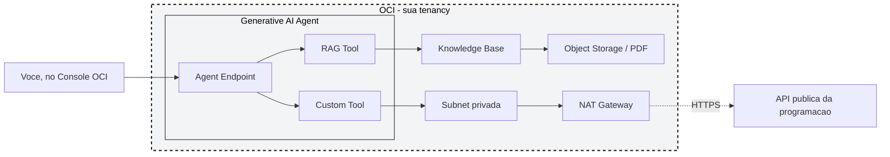

# Lab TDC: AI Agents na OCI com Terraform (RAG + Custom Tool)

Este projeto e a versao Terraform do [tdc-oci-ai-agents-lab](https://github.com/LiviaFernandes/tdc-oci-ai-agents-lab). A pergunta de negocio e a mesma: criar um agente que responde sobre o TDC Floripa 2026 combinando **RAG** (base estatica em PDF) e uma **Custom Tool** (busca estruturada na programacao via API publica). A diferenca e que aqui nao existe clique no Console: compartment, grupo, policy, rede, bucket, Knowledge Base, agent, tools e endpoint sobem tudo via `terraform apply`, do zero, numa tenancy trial.

O estilo de infraestrutura-como-codigo segue a mesma ideia dos stacks tipo [OpenClaw/Hermes na OCI](https://github.com/MachadoAmanda/oracle/tree/main/Agent%20Station%20Experience): poucas variaveis pra preencher, a stack sobe sozinha, e no final voce recebe os IDs prontos pra abrir o agente no Console e testar.

## Demo do lab

O agente responde perguntas como:

```text
Quando acontece o TDC Floripa 2026?
```

```text
Quais trilhas existem no dia 22 de julho?
```

```text
Quais palestras a Livia Rodrigues vai fazer?
```

Perguntas sobre conceitos gerais, jornadas, formato, FAQ e regras usam **RAG** porque estao no PDF. Perguntas sobre busca estruturada de sessoes, speakers, trilhas por dia e filtros usam **Custom Tool** porque dependem da API de programacao.

## Arquitetura



Diferente do lab manual, aqui a rede e minima: so subnet privada + NAT Gateway. Nao existe subnet publica nem Internet Gateway porque nenhum recurso deste lab precisa de IP publico - o unico trafego e o egress HTTPS que a Custom Tool faz para a API de programacao.

A Custom Tool usa a mesma API ja publicada do lab original:

```text
https://tdc-oci-ai-agents-lab.onrender.com
```

Se voce quiser apontar para a sua propria copia da API, troque a variavel `custom_tool_api_url`.

## Pre-requisitos

- Conta OCI Trial ativa.
- [Terraform](https://developer.hashicorp.com/terraform/install) >= 1.5.
- [OCI CLI](https://docs.oracle.com/en-us/iaas/Content/API/SDKDocs/cliinstall.htm) configurado (`oci setup config`), para o provider Terraform usar suas credenciais via `~/.oci/config`.
- Regiao com OCI Generative AI Agents disponivel. Confira a lista atual na [documentacao do servico](https://docs.oracle.com/en-us/iaas/Content/generative-ai-agents/overview.htm).
- Como e uma tenancy trial nova, o dono da conta ja e administrator por padrao, entao ja tem acesso pra criar compartment, grupo e policy.

## 1. Preparar as variaveis

Va para a pasta do lab:

```bash
cd terraform/trial-tenancy
```

Copie o arquivo de variaveis:

```bash
cp terraform.tfvars.example terraform.tfvars
```

Preencha `terraform.tfvars` com:

```text
tenancy_ocid = ocid da sua tenancy
user_ocid    = ocid do seu usuario
region       = regiao com Generative AI Agents disponivel
```

Onde encontrar:

- `tenancy_ocid`: no OCI Console, clique no seu perfil (canto superior direito) e depois em **Tenancy**.
- `user_ocid`: no OCI Console, clique no seu perfil e depois em **User settings**.

## 2. Rodar o Terraform

```bash
terraform init
terraform plan
terraform apply
```

O `apply` cria, nessa ordem:

```text
compartment tdc-ai-agents-lab
grupo tdc-ai-agents-users, com voce como membro
policy no root da tenancy
VCN com subnet privada e NAT Gateway
bucket com o PDF da base RAG
Knowledge Base + data source + job de ingestao
o agent
RAG tool
Custom Tool
Agent Endpoint
```

Costuma levar entre 5 e 10 minutos, a maior parte do tempo e a criacao da Knowledge Base e do endpoint.

## 3. Conferir os outputs

```bash
terraform output
```

Os outputs trazem os IDs de cada recurso criado e uma dica de onde clicar no Console pra abrir o chat.

## 4. Testar no chat

Abra o OCI Console em **Analytics & AI > Generative AI Agents > Agent endpoints**, clique no endpoint criado e depois em **Launch chat**.

### Teste 1: RAG com informacao geral do evento

```text
O que sao as Jornadas TDC e como elas ajudam uma pessoa a escolher melhor a experiencia dela no TDC Floripa 2026?
```

Resultado esperado: resposta conceitual sobre Jornadas TDC e formato do evento. O trace deve mostrar uso da RAG Tool `consulta_base_tdc`.

### Teste 2: Custom Tool com speaker especifica

```text
Quais palestras a Livia Rodrigues vai fazer?
```

Resultado esperado: resposta com as sessoes da Livia Rodrigues Fernandes Silva. O trace deve mostrar chamada a `consulta_programacao_tdc`.

### Teste 3: RAG + Custom Tool na mesma resposta

```text
Estou interessado em GenAI e agentes. Explique rapidamente como o TDC organiza trilhas ou jornadas e depois liste sessoes da programacao que falem sobre agentes.
```

Resultado esperado: a primeira parte vem da RAG, a segunda vem da Custom Tool, listando sessoes filtradas por `agentes` ou termos relacionados.

### Teste 4: roteiro personalizado

```text
Tenho acesso ao dia 24/jul e me interesso por GenAI, LLMs e avaliacao de modelos. Monte um roteiro objetivo para mim com as sessoes mais relevantes, horarios e trilha.
```

Resultado esperado: o agente usa a Custom Tool pra buscar sessoes do dia 24/jul relacionadas a GenAI/LLMs e monta um roteiro em ordem de horario.

## Variaveis principais

As variaveis com valor padrao (nomes de recursos, mensagens do agente, descricao das tools) estao em `terraform/trial-tenancy/variables.tf` e podem ser sobrescritas no `terraform.tfvars`. As mais importantes:

| Variavel | Descricao |
| --- | --- |
| `tenancy_ocid`, `user_ocid` | Identificam a tenancy e o usuario que entra no grupo do lab. |
| `region` | Regiao OCI com Generative AI Agents disponivel. |
| `custom_tool_api_url` | URL base da API de programacao usada pela Custom Tool. |
| `agent_instruction` | System prompt do agente. |

## Custo, sem complicar

| Parte | Como pensar |
| --- | --- |
| Rede | VCN, subnet privada, NAT Gateway e security list nao cobram por existir; trafego de saida pode seguir as regras de cobrança da OCI. |
| Object Storage | O PDF da base RAG e pequeno; dentro do free tier na maioria das tenancies. |
| Generative AI Agents | Knowledge Base, agent e tools cobram por uso (consultas, ingestao, tokens do LLM por tras do RAG e das respostas). Usou pouco no lab, paga pouco. |

Para nao deixar recursos ligados sem necessidade, destrua o lab quando terminar:

```bash
terraform destroy
```

## Rodando via Resource Manager

Se preferir nao instalar Terraform localmente, de um zip na pasta `terraform/trial-tenancy` e suba como Stack:

1. Abra o OCI Console.
2. Va em **Developer Services > Resource Manager > Stacks**.
3. Clique em **Create Stack**, escolha upload de `.zip`.
4. Envie o zip, selecione o compartment e de um nome pra stack.
5. Marque **Run apply** na criacao, ou rode um Apply depois.
6. Ao terminar, confira os outputs na aba de outputs da stack.
